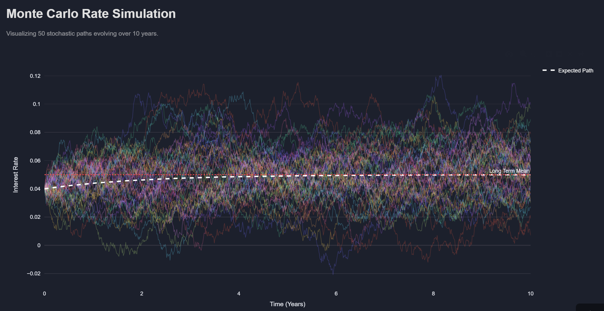
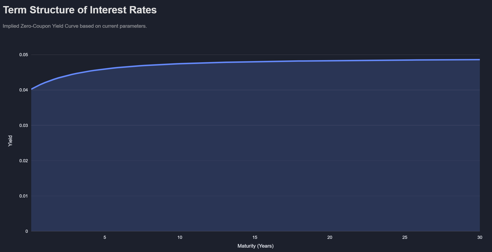
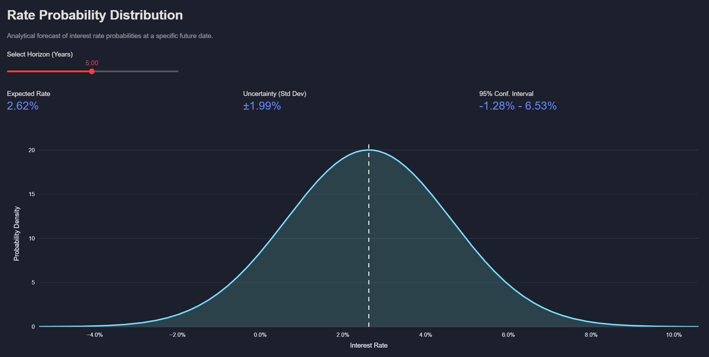

# Vasicek Interest Rate Pricing Engine

[](https://vasicek.streamlit.app)


> **Live Demo:** [Click here to launch the dashboard](https://vasicek.streamlit.app)

## 📉 Project Overview
This project is an interactive quantitative finance dashboard that models interest rate term structures using the **Vasicek Short-Rate Model**.

Built with **Python** and **Streamlit**, it serves as a pricing engine that bridges the gap between Stochastic Differential Equations (SDEs) and practical risk management. It demonstrates how mean reversion affects bond pricing and allows users to visualise complex risk scenarios, such as yield curve inversions, in real time.

### 🎯 Key Objectives
* **Stochastic Modelling:** Visualise the evolution of interest rates using Monte Carlo simulations.
* **Analytical Pricing:** Derive the Zero-Coupon Yield Curve using the model's affine term structure.
* **Risk Forecasting:** Quantify interest rate probabilities using analytical statistical properties (Ornstein-Uhlenbeck process).

---

## 📸 Screenshots




---

## 🧮 The Mathematics
The core of the engine relies on the Vasicek SDE, which assumes the instantaneous short rate $r_t$ follows a mean-reverting process:

$$dr_t = a(b - r_t)dt + \sigma dW_t$$

Where:
* $a$: Speed of mean reversion.
* $b$: Long-term mean equilibrium.
* $\sigma$: Instantaneous volatility.
* $dW_t$: Wiener process under the risk-neutral measure $\mathbb{Q}$.

### Closed-Form Bond Pricing
A key feature of this project is the implementation of the **Affine Term Structure** solution. The price of a Zero-Coupon Bond $P(t,T)$ is calculated analytically, ensuring $O(1)$ performance rather than relying on computationally expensive Monte Carlo convergence for pricing:

$$P(t, T) = A(t, T) e^{-B(t, T) r_t}$$

---

## 🛠️ Technical Implementation

### 1. Euler-Maruyama Discretisation
To simulate the SDE, I implemented the Euler-Maruyama method. The random shock is scaled by $\sqrt{dt}$ to account for the properties of Brownian Motion variance ($Var(W_t) = t$).

```python
# Snippet from vasicek.py
shock = sigma * np.sqrt(dt) * np.random.normal()
rates[t] = rates[t-1] + drift + shock
```

## Tech Stack
- Frontend: Streamlit (Custom CSS for glassmorphism/fintech UI).
- Computation: NumPy & SciPy (Vectorised calculations for yield curves).
- Visualisation: Plotly (Interactive charts with 'hover-unified' contexts).
  
## Installation & Usage
To run this project locally:

Clone the repository
```Bash
git clone [ttps://github.com/sahmed0/bond-pricing.git
cd bond-pricing
```
Create a virtual environment
```Bash
python -m venv venv
source venv/bin/activate  # On Windows use: venv\Scripts\activate
```
Install dependencies
```Bash
pip install -r requirements.txt
```
Launch the application
```Bash
streamlit run app.py
```

## Insights & Risk Analysis
The dashboard includes logic to detect Yield Curve Inversion ($r_{long} < r_{short}$), a reliable leading indicator of economic recession. The probability forecaster also calculates 95% Confidence Intervals for future rates, aiding in VaR (Value at Risk) analysis.
