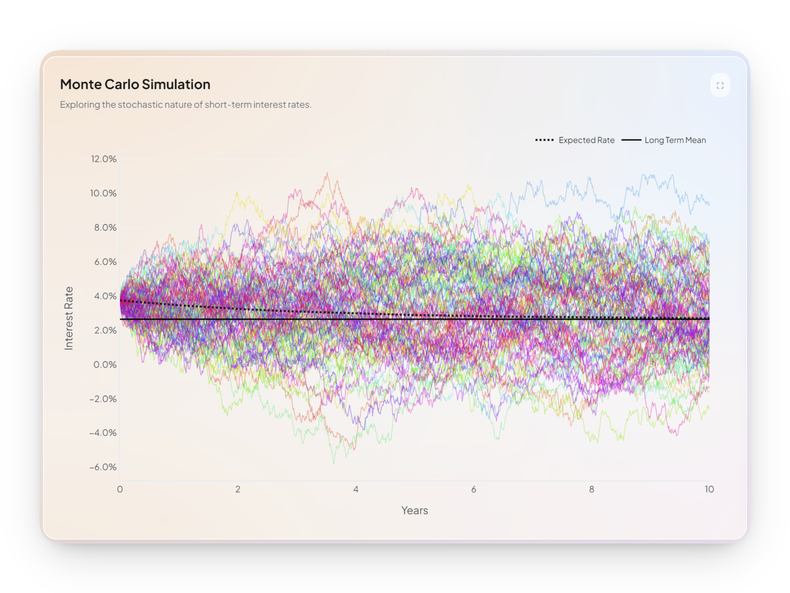
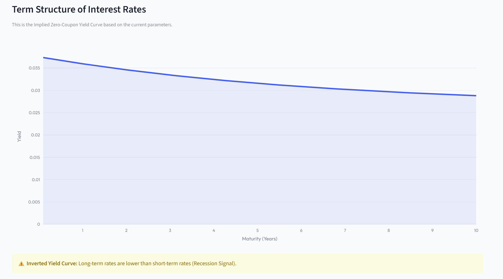
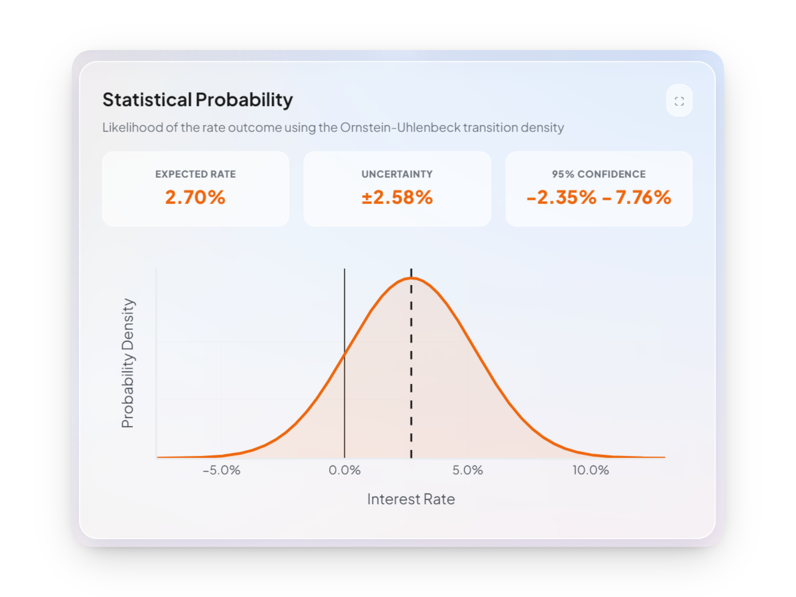

# Vasicek Interest Rate Model

[](https://www.gnu.org/licenses/gpl-3.0)


## ⏯️ [Click here to launch the dashboard](https://sajidahmed.co.uk/vasicek-rate-model/)

## Project Overview
This project is an interactive quantitative finance dashboard that models interest rate term structures using the **Vasicek Short-Rate Model**.

Built with **Python** and **Streamlit**, it bridges the gap between solving Stochastic Differential Equations (SDEs) and modelling Bonds and Interest Rates. It demonstrates how mean reversion affects bond pricing and allows users to visualise complex risk scenarios, such as yield curve inversions, in real time.

### Key Objectives
* **Stochastic Modelling:** Visualise the time-evolution of interest rates according to the Vasicek Model using the Euler-Maruyama method and Monte Carlo simulations.
* **Analytical Pricing:** Derive the Zero-Coupon Yield Curve using the model's affine term structure.
* **Risk Forecasting:** Quantify interest rate probabilities using the Normal Distribution.

---

## 📸 Screenshots
This is an example simulation with the following parameters:
* Current Rate ($$r_0$$) = 3.75% (UK short-term base rate as of Jan 2026)
* Long Term Mean ($$b$$) = 2.65% (UK long term mean since the 2008 financial crisis)
* Reversion Speed ($$a$$) = 0.30 
* Volatility ($$σ$$) = 0.020
* Time Horizon ($$Yrs$$) = 10
* Simulations ($$N$$) = 100


This figure shows the stochastic paths for the short-term interest rate over a 10 year period, calculated via 100 Monte Carlo simulations using the Euler-Maruyama discretisation method. The dotted line shows the expected interest rate over this time. (Only 100 simulations were used to avoid overcrowding of the graph for illustrative purposes, however the model is capable of making thousands of simulations.)


This figure shows the predicted zero-coupon bond yield curve over a 10 year period.


This figure shows the probability distribution of the short-term interest rate in 5 years time. The interest rate is expected to be 2.90%.

---

## The Mathematics
The core of the webapp relies on the Vasicek Model SDE, which assumes the instantaneous short rate $r_t$ follows a mean-reverting process:

$$dr_t = a(b - r_t)dt + \sigma dW_t$$

Where:
* $a$: Speed of mean reversion.
* $b$: Long-term mean equilibrium.
* $\sigma$: Instantaneous volatility.
* $dW_t$: Wiener process under the risk-neutral measure $\mathbb{Q}$.

The webapp solves this equation using the **Euler-Maruyama Discretisation method** and **Monte Carlo Simulation**.

### Euler-Maruyama Discretisation
To simulate the SDE, I implemented the Euler-Maruyama method. The random shock is scaled by $\sqrt{dt}$ to account for the properties of Brownian Motion variance ($Var(W_t) = t$).

```python
# Snippet from vasicek.py
shock = sigma * np.sqrt(dt) * np.random.normal()
rates[t] = rates[t-1] + drift + shock
```

### Closed-Form Bond Pricing
A key feature of this project is the implementation of the **Affine Term Structure** solution. The price of a Zero-Coupon Bond $P(t,T)$ is calculated analytically, ensuring $O(1)$ performance rather than relying on computationally expensive Monte Carlo convergence for pricing:

$$P(t, T) = A(t, T) e^{-B(t, T) r_t}$$

---

## Technical Implementation

## Tech Stack
- Frontend: Streamlit (Custom CSS for glassmorphism/fintech UI).
- Computation: NumPy & SciPy (Vectorised calculations for yield curves).
- Visualisation: Plotly (Interactive charts with 'hover-unified' contexts).
  
## Installation & Usage
To run this project locally:

Clone the repository
```Bash
git clone [ttps://github.com/sahmed0/vasicek-rate-model.git
cd vasicek-rate-model
```
Create a virtual environment
```Bash
python -m venv venv
source venv/bin/activate  # On Windows use: venv\Scripts\activate
```
Install dependencies
```Bash
pip install -r requirements.txt
```
Launch the application
```Bash
streamlit run app.py
```

## Insights & Risk Analysis
The dashboard includes logic to detect Yield Curve Inversion ($r_{long} < r_{short}$), a reliable leading indicator of economic recession. The probability forecaster also calculates 95% Confidence Intervals for future rates, aiding in VaR (Value at Risk) analysis.

## License

Copyright © 2026 Sajid Ahmed

This program is free software: you can redistribute it and/or modify it under the terms of the **GNU General Public License** as published by the Free Software Foundation, either version 3 of the License, or (at your option) any later version.

This program is distributed in the hope that it will be useful, but **WITHOUT ANY WARRANTY**; without even the implied warranty of **MERCHANTABILITY** or **FITNESS FOR A PARTICULAR PURPOSE**. 

See the [LICENSE](LICENSE) file for more details.
