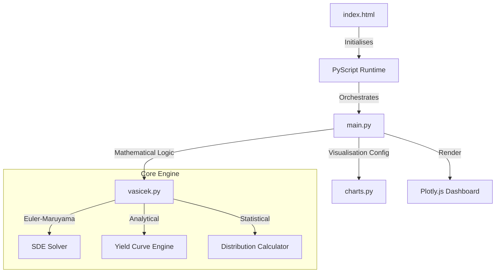

# Vasicek Rate Model | Interactive Stochastic Simulation

[](https://www.gnu.org/licenses/gpl-3.0)
[](https://www.python.org/)
[](https://pyscript.net/)

An interactive web-based dashboard for exploring the **Vasicek Interest Rate Model**. This application performs real-time stochastic simulations, yield curve derivations, and probability forecasting entirely within the browser using PyScript.

[**Live Demo**](https://sajidahmed.co.uk/vasicek-rate-model/)

---

## Table of Contents
- [Key Features](#key-features)
- [Architecture](#architecture)
- [The Mathematics](#the-mathematics)
- [Tech Stack](#tech-stack)
- [Key Decisions](#key-decisions)
- [Installation & Usage](#installation--usage)
- [License](#license)

---

## Key Features

### 1. Monte Carlo Simulation
Visualise hundreds of independent interest rate paths generated via Euler-Maruyama discretisation. The simulator accounts for mean reversion and volatility shocks in real-time.


### 2. Analytical Yield Curve
Derive the theoretical term structure for zero-coupon bonds based on the affine property of the Vasicek model.


### 3. Probability Distribution Forecasting
Calculate the statistical likelihood of rate outcomes at any future horizon using the Ornstein-Uhlenbeck transition density.


### 4. Interactive "Bento Box" Dashboard
A modern, glassmorphic UI that provides immediate feedback as model parameters are adjusted. Includes dynamic KaTeX typesetting for mathematical transparency.

---

## Architecture

### System Flow
The application follows a modular architecture where PyScript orchestrates the bridge between Pythonic scientific logic and JavaScript-driven visualisations.


```mermaid
graph TD
    A[index.html] -->|Initialises| B[PyScript Runtime]
    B -->|Orchestrates| C[main.py]
    C -->|Mathematical Logic| D[vasicek.py]
    C -->|Visualisation Config| E[charts.py]
    
    subgraph "Core Engine"
        D -->|Euler-Maruyama| F[SDE Solver]
        D -->|Analytical| G[Yield Curve Engine]
        D -->|Statistical| H[Distribution Calculator]
    end
    
    C -->|Render| I[Plotly.js Dashboard]
```

### Directory Tree
```text
vasicek-rate-model/
├── public/                 # Static assets and UI screenshots
├── charts.py               # Plotly chart configuration logic
├── index.html              # Main UI and application entry point
├── main.py                 # PyScript orchestration and event handling
├── pyscript.toml           # PyScript environment configuration
├── requirements.txt         # Python dependencies (NumPy, SciPy)
└── vasicek.py              # Core mathematical implementation
```

---

## The Mathematics

The Vasicek model describes the evolution of interest rates as a **Stochastic Differential Equation (SDE)**:

$$dr_t = a(b - r_t)dt + \sigma dW_t$$

- **$a$ (Reversion Speed)**: The rate at which the process pulls back to the mean.
- **$b$ (Long-Term Mean)**: The equilibrium interest rate level.
- **$\sigma$ (Volatility)**: The magnitude of random market shocks.
- **$dW_t$ (Wiener Process)**: Represents the stochastic component (Brownian Motion).

---

## Tech Stack

| Component | Technology |
| :--- | :--- |
| **Runtime** | [PyScript](https://pyscript.net/) (Pyodide) |
| **Mathematics** | [NumPy](https://numpy.org/), [SciPy](https://scipy.org/) |
| **Visualisation** | [Plotly.js](https://plotly.com/javascript/) |
| **Typesetting** | [KaTeX](https://katex.org/) |
| **Styling** | Vanilla CSS3 (Glassmorphism, Bento Grid) |

---

## Key Decisions

| Decision | Rationale |
| :--- | :--- |
| **Client-side Execution** | Eliminates server costs and latency by running scientific simulations directly in the user's browser. |
| **Vectorised Operations** | NumPy is utilised to generate hundreds of simulation paths simultaneously, ensuring fluid UI updates. |
| **Decoupled Logic** | High-performance Python logic is separated from UI orchestration, allowing for easier auditing of the SDE implementation. |

---

## Installation & Usage

### Prerequisites
- A modern web browser with WebAssembly support (Chrome, Firefox, Safari, Edge).
- A local web server for development.

### Local Development
1. Clone the repository:
   ```bash
   git clone https://github.com/sahmed0/vasicek-rate-model.git
   ```
2. Navigate to the project directory:
   ```bash
   cd vasicek-rate-model
   ```
3. Start a local server (e.g., using Python):
   ```bash
   python -m http.server 8000
   ```
4. Open `http://localhost:8000` in your browser.

---

## License

This project is licensed under the **GNU General Public License v3.0**. See the [LICENSE](LICENSE) file for the full text.
